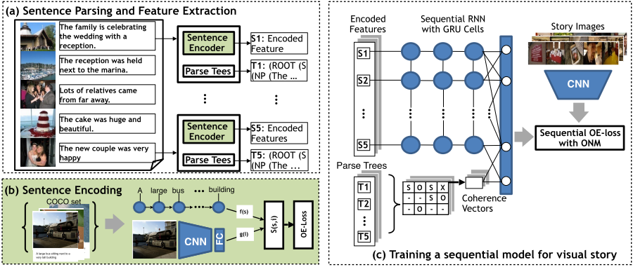

# Coherent Neural Story Illustration
Story Illustration is the problem of retrieving/generating a sequence of images, given a natural language story as input. We propose a hierarchical [GRU](https://en.wikipedia.org/wiki/Gated_recurrent_unit) network that learns a representation for the input story and use it to retrieve an ordered set of images from a dataset. In its core, the model is designed to explicitly model coherence between sentences in a story optimized over sequential order embedding based loss function. This repository has the code to replicate experiments detailed in our paper titled "Show Me a Story: Towards Coherent Neural Story Illustration" ([PDF](http://openaccess.thecvf.com/content_cvpr_2018/papers/Ravi_Show_Me_a_CVPR_2018_paper.pdf)). The proposed network architecture is shown in the [Figure](./net_arch.png) below. 




## Install Instructions

- For the model 

  1. Download dataset from http://visionandlanguage.net/VIST/dataset.html
  2. Put sis (text) , dii (text) and images folder inside [./data/raw](./data/raw)
  3. Download glove_6B_300 dim vectors from https://nlp.stanford.edu/projects/glove/ and put it in [./data/](./data/) folder
  4. `conda create --name <env> --file requirements.txt` (This is an extensive list that might include unnecessary packages as well. But basically following are the main packages necessary to run the code. Install the latest version using conda install)
     - python
     - tensorflow-gpu
     - keras 
     - pandas
     - pillow 
     - numpy
     - pycorenlp

- For the coherence vector (Works only in Linux. Let us know if you make it work in Windows)

  1. Download stanford codeNLP (3.9.2) from https://stanfordnlp.github.io/CoreNLP/ to [root dir](./).
    
     - `unzip stanford-corenlp-full-2018-10-05.zip`
     - `mv stanford-corenlp-full-2018-10-05.zip stanford-core`
     
  2. Download stanford parser (3.9.2) from https://nlp.stanford.edu/software/lex-parser.shtml to [root dir](./).
     - `unzip stanford-parser-full-2018-10-17.zip`
     - `mv stanford-corenlp-full-2018-10-17.zip stanford-parser`
     - `cd stanford-parser`
     - `jar xvf stanford-parser-3.9.2-models.jar`

  3. Download WordNet-3.0.tar.gz from https://wordnet.princeton.edu/download/current-version to [root dir](.).
     - `tar xvzf WordNet-3.0.tar.gz`
     - add `#define USE_INTERP_RESULT` before `#include <tcl.h>` in `WordNet-3.0/src/stubs.c/`
     - `cd WordNet-3.0` and `sudo ./configure`
     - `sudo make` and `sudo make install`
     
  4. Download and Install Brown Coherence Model (https://bitbucket.org/melsner/browncoherence/src/default/) to [root dir](.)
     - `wget https://bitbucket.org/melsner/browncoherence/get/d46d5cd3fc57.zip -O browncoherence.zip`
     - `unzip browncoherence.zip`
     - `mv melsner-browncoherence-d46d5cd3fc57 browncoherence`
     - `cd browncoherence`
     - `mkdir lib64`
     - `mkdir bin64`
     - `vim include/common.h` and modify DATA_PATH definition to point to "./data/"
     - `tar -xvjf data/ldaFiles.tar.bz2 `
     - `bzip2 -dk models/ww-wsj.dump.bz2`
     - `vim Makefile`
     
       Change the following from top to bottom.
       ```
       WORDNET = 1
       WORDNET = 0
       ```
       ```
       CFLAGS = $(WARNINGS) -Iinclude $(WNINCLUDE) $(TAO_PETSC_INCLUDE) $(GSLINCLUDE)
       CFLAGS = $(WARNINGS) -Iinclude $(WNINCLUDE) $(TAO_PETSC_INCLUDE) $(GSLINCLUDE) -fpermissive 
       ```
       ```
       WNLIBS = -L$(WNDIR)/lib -lWN
       WNLIBS = -L$(WNDIR)/lib -lwordnet
       ```
       Modify `WNDIR` to point to Wordnet installation (usually it will be `usr/local/WordNet-3.0`)
     - `make everything`
     - modify `testgrid_path = /absolute-path-to/browncoherence/bin64/TestGrid` in [entity_score.py](./coherence_vector/entity_score.py)
     - `cd ..` and `sudo cp -r ./browncoherence/data ./browoncoherence/data/bin64/`

- Download COCO image features and splits as provided by https://github.com/ivendrov/order-embedding and https://github.com/karpathy/neuraltalk from [here](https://drive.google.com/open?id=16f1Wg80Mf38C7j57ngKjq4v2zjkOr-IS) and put them inside [./data](./data/). We use the same specifications for pretraining. 

## To run codes on VIST data
Parameters for all processes below can be modified in `config.json`. If no file is present, `config.json` is created by `configAll.py` and hence might be valuable to change there as well.
1. preprocessing (You can SKIP this step by downloading preprocessed files from [here](https://drive.google.com/open?id=1hc_Q1nF5rTBqNJNWCoYtK01axQhfAMgX) and putting them inside [./data/](./data/))
    - `python run.py --preprocess data` to get data files ready
    - `python run.py --preprocess imagefeatures` to get VGG16 features for all images in the data. NOTE: This code also removes stories that do not have images.
    - `python run.py --preprocess coherencevectors` to extract coherence vectors for all stories (has to be run after image features are extracted)
    - NOTE: The preprocessed zip file has coherence vectors, VIST processed data and VIST VGG16 image features, that was part of our paper.
2. training
    - For Baseline
      - `python run.py --train baseline` will train the baseline model on VIST dataset.
    - For Proposed
      - `python run.py --pretrain` will pretrain stage 1 model on MS COCO dataset. 
      - `python run.py --train stage1` will train stage 1 model on VIST dataset.  
      - `python run.py --train modeltype` (replace 'model type' with 'cnsi' or 'nsi' depending on the required model)
3. prediction
    - `python run.py --eval modeltype` where modeltype can be 'cnsi', 'nsi', or 'baseline'.
4. illustrate (not yet implemented)
    - `python run.py --show modeltype`, where modeltype can be 'cnsi', 'nsi', or 'baseline'.
NOTE: skip step 1 and 2 and download trained models from this link to evaluate the proposed models.  

## To run trained models on different data
1. Put the story in `test_text.csv` in [./data/test/](./data/test/).
2. If you have images, then put their IDs in corresponding rows of their stories in `test_image.csv`.
3. Put the actual images in [./data/raw/images/test/](./data/raw/images/test/).
4. Extract vggfeat for these images by modifying vggfeat_vist.py code.
5. Modify [./data/test_samples.txt](./data/test_samples.txt) to include row numbers of the new test data or totally replace existing ones. 
6. Execute prediction and illustrate steps from above.

## Reference
If you use this code or any part of it, please cite the following paper. 
```
@InProceedings{Ravi_2018_CVPR,
author = {Ravi, Hareesh and Wang, Lezi and Muniz, Carlos and Sigal, Leonid and Metaxas, Dimitris and Kapadia, Mubbasir},
title = {Show Me a Story: Towards Coherent Neural Story Illustration},
booktitle = {The IEEE Conference on Computer Vision and Pattern Recognition (CVPR)},
month = {June},
year = {2018}
}
```
